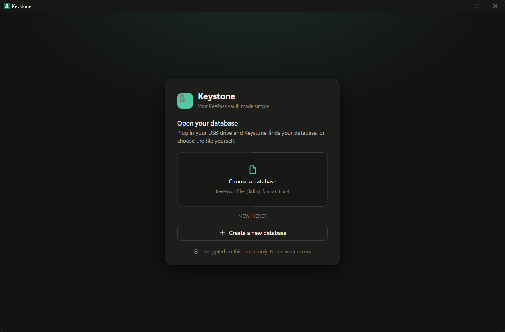
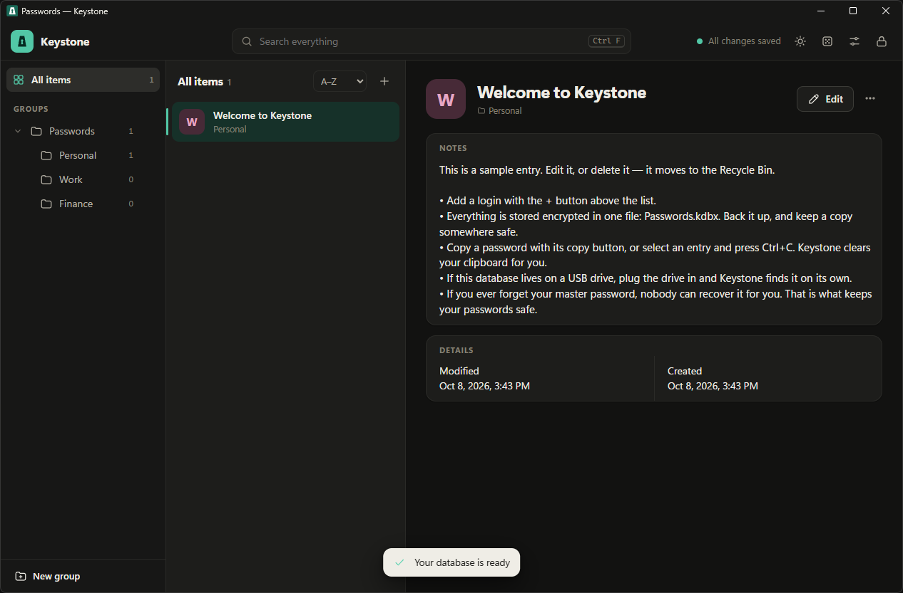
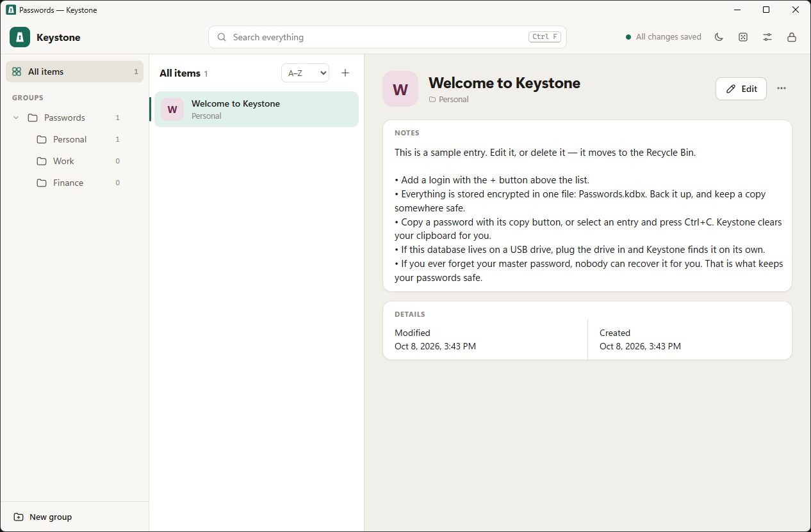

# Keystone

**A simple, modern password vault for Windows that opens and creates standard KeePass (`.kdbx`) databases.**

Keystone gives your KeePass database a calmer, friendlier interface. It reads and writes the same files as KeePass, so you can use both side by side. There is no account, no cloud and no sync service: your passwords live in one encrypted file that you keep.

> **Early release.** Keystone 1.0 has not had an independent security audit. Please read [SECURITY.md](SECURITY.md) before you store anything critical in it, and keep a backup of your database.



## Highlights

- **Works with KeePass.** Opens and saves KeePass 2 databases (KDBX 3 and 4), with a password, a key file (`.keyx` / `.key`), or both. Nothing to import or convert: you open your `.kdbx` where it is.
- **New here? Create a database in a minute.** Pick a name and a place, choose a password and/or a key file, and Keystone makes a modern KeePass database (Argon2id, AES-256) with starter groups and a short welcome note.
- **USB-drive friendly.** Keep `Database.kdbx` and `Database.keyx` on a USB stick and install Keystone on every computer you use. Plug the stick in and Keystone finds the database and key file on its own, even when Windows gives the stick a different drive letter.
- **Everyday comforts.** Groups, tags and search; custom fields; attachments; one-time codes (TOTP); version history with restore; a Recycle Bin with Undo; password generator and strength meter; drag an entry onto a group to move it; light and dark themes.
- **Careful with your secrets.** Clipboard cleared automatically and kept out of Windows clipboard history, auto-lock when idle or when Windows locks, window hidden from screenshots, optional lock when the USB drive is removed.
- **Careful with your file.** Saves are written atomically and verified; Keystone offers a backup of the original before its first save; it asks before overwriting a file that changed on disk.
- **Private by design.** The app makes no network connections at all (see [SECURITY.md](SECURITY.md)).

<p>
  
  
</p>

## Install

1. Download **`Keystone-Setup-1.0.0.exe`** from the [latest release](https://github.com/clammytoast/keystone/releases/latest).
2. *(Recommended)* check it was not damaged or swapped. In PowerShell:

   ```powershell
   (Get-FileHash .\Keystone-Setup-1.0.0.exe -Algorithm SHA256).Hash
   ```

   The result must match the SHA-256 listed in the release notes.
3. Run it and press **Install**. No administrator rights are needed; it installs for your user.

**Windows may warn you.** The installer is not code-signed yet, so SmartScreen can show "Windows protected your PC" (choose *More info → Run anyway*), and on PCs with Smart App Control turned on it may be blocked. Signing needs a paid certificate; see [Code signing](docs/releasing.md#code-signing).

**Requirements:** Windows 10 or 11 and the Microsoft Edge **WebView2 Runtime**, which comes with Windows 11 and current Windows 10. If it is missing, the installer shows a link to Microsoft's download page.

Prefer not to install? `Keystone.exe` is a single portable file you can run from anywhere, including a USB drive.

To remove Keystone use **Settings → Apps → Keystone**. Your databases and key files are never touched; you can choose to also delete Keystone's own settings.

## Getting started

- **First time:** press **Create a new database**, choose a name, where to save it, and how to protect it (password, key file, or both). Done.
- **You already use KeePass:** press **Choose a database** (or drop the `.kdbx` on the window) and add your key file if it has one. Keystone remembers it for next time.
- **USB drive:** plug it in. Keystone selects the database and key file for you and puts the cursor in the password box.

Unlock with whatever your database uses: tick **Master password**, **Key file**, or both, exactly as in KeePass. Keystone remembers the choice for each database.

### Keyboard shortcuts

| | |
|---|---|
| Search | `Ctrl F` or `/` |
| New entry | `Alt N` |
| Copy password | `Ctrl C` (with an entry selected and nothing highlighted) |
| Copy username | `Ctrl B` |
| Open website | `Ctrl U` |
| Save | `Ctrl S` |
| Lock | `Ctrl L` |

## Compatibility

| | Supported |
|---|---|
| File format | KDBX 3.x (read; upgraded to 4 when saved) and KDBX 4.x (read and write) |
| Encryption | AES-256, ChaCha20 |
| Key derivation | AES-KDF, Argon2d, Argon2id |
| Key files | KeePass XML (v1 and v2, `.keyx`), 32-byte, 64-hex, and any other file (hashed) |
| Not supported yet | Twofish databases, Windows-account keys, auto-type, KeePass plugins, browser integration, sync, import/export of other formats |

Keystone is tested against databases written by the real KeePass 2.61 library, and files written by Keystone are opened back with it: see [tests/README.md](tests/README.md). KeePass and other KeePass-compatible apps can open databases that Keystone creates or saves.

## Build from source

You only need Windows 10/11. Nothing else has to be installed: the build uses the C# compiler and PowerShell that ship with Windows.

```powershell
git clone https://github.com/clammytoast/keystone.git
cd keystone

# 1. the app:        Keystone.exe
powershell -ExecutionPolicy Bypass -File windows\build-windows.ps1

# 2. the installer:  dist\Keystone-Setup-1.0.0.exe
powershell -ExecutionPolicy Bypass -File windows\installer\build-installer.ps1
```

The first script bundles the interface (`src/`) into `build\Keystone.html`, then embeds it, together with Microsoft's WebView2 helper libraries from `windows\lib`, into the native host `windows\Program.cs`. The second embeds `Keystone.exe` into the installer `windows\installer\Setup.cs`.

| Folder | What is in it |
|---|---|
| `src/` | The interface: KDBX reader/writer (`kdbx.js`), key derivation worker (`worker.js`), vault model (`vault.js`), screens (`app*.js`, `create.js`), styles |
| `windows/` | The Windows host (window, file dialogs, clipboard, USB detection), the installer, the icon generator, WebView2 libraries |
| `tests/` | Compatibility tests against the real KeePass library |
| `docs/` | Architecture notes, the host bridge, release steps, screenshots |

More in [docs/architecture.md](docs/architecture.md).

## Contributing and security

Bug reports and ideas are welcome: see [CONTRIBUTING.md](CONTRIBUTING.md). **Please report security problems privately**, as described in [SECURITY.md](SECURITY.md), not as public issues.

## License

[MIT](LICENSE). Third-party components are listed in [THIRD_PARTY_NOTICES.md](THIRD_PARTY_NOTICES.md). Keystone is not affiliated with the KeePass project; "KeePass" is used only to describe file compatibility.
